# String Calculator – Incubyte TDD Assessment

This project is a solution to the *String Calculator Kata* using *Test-Driven Development (TDD)* in Python. It is part of the recruitment assessment for Incubyte Software Craftsperson role.

---

## 🧪 Requirements Covered

This string calculator handles:

* ✅ Empty strings → returns 0
* ✅ Single number → returns the number
* ✅ Two or more comma-separated numbers → returns their sum
* ✅ Newline as a delimiter → supports "1\n2,3"
* ✅ Custom single-character delimiter → e.g. "//;\n1;2"
* ✅ Negative number detection → throws exception with message "negative numbers not allowed -2,-3"
* ✅ Ignores numbers greater than 1000 → e.g. "2,1001" returns 2
* ✅ Delimiters of any length → "//\[***]\n1***2\*\*\*3"
* ✅ Multiple delimiters → "//\[*]\[%]\n1*2%3"
* ✅ Multiple delimiters of any length → "//\[***]\[%%]\n1***2%%3"
* ✅ Only delimiters, no numbers → returns 0

---

## 📁 Project Structure

```
String-Calculator-Incubyte-TDD-Assessment/
├── screenshots/              # TDD step-by-step screenshots
│   ├── Step_1.png
│   ├── Step_2.png
│   ├── ...
│   └── Step_12.png
├── string_calculator_tdd/
│   ├── calculator.py         # Main implementation
│   ├── test_calculator.py    # All test cases using pytest
├── requirements.txt          # Dependencies
├── .gitignore                # Git ignored files (e.g., __pycache__, .pytest_cache)
└── README.md                 # This file
```

---

## ⚙ How to Run

### 1. Clone the repo

```bash
git clone https://github.com/maharshijani05/String-Calculator-Incubyte-TDD-Assessment.git
cd String-Calculator-Incubyte-TDD-Assessment
```

### 2. Create a virtual environment (optional but recommended)

```bash
python -m venv venv
source venv/bin/activate  # On Windows: venv\Scripts\activate
```

### 3. Install dependencies

```bash
pip install -r requirements.txt
```

### 4. Run tests

```bash
pytest string_calculator_tdd/test_calculator.py
```

---

## 🧪 Sample Output

```bash
================== test session starts ==================
collected 12 items

test_calculator.py ............

=================== 12 passed in 0.20s ==================
```

---

## 📸 Screenshots (TDD Steps)

| Step    | Screenshot                   |
| ------- | ---------------------------- |
| Empty String → Returns 0  | 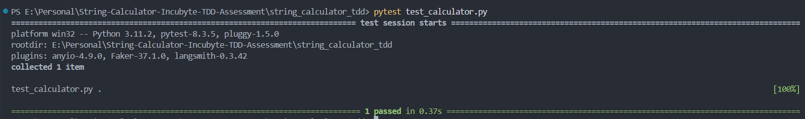  |
| Single Number  | 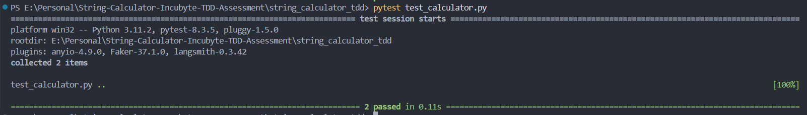  |
| Two Numbers, Comma Separated  | 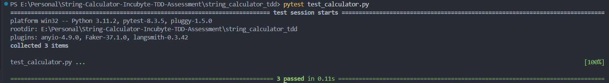  |
| Multiple Numbers  | 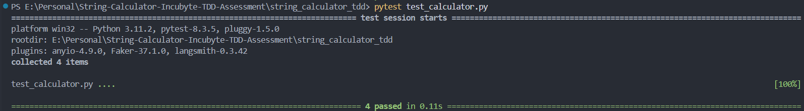  |
| Newlines as Delimiters  | 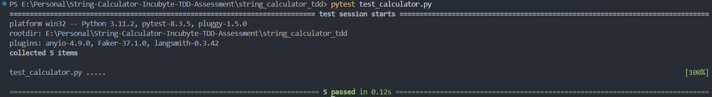  |
| Custom Single-Char Delimiter  | 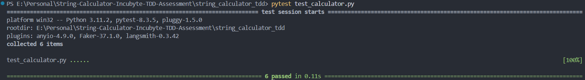  |
| Negative Numbers → Exception Raised  | 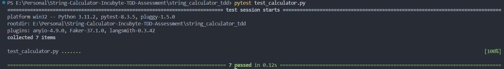  |
| Ignore Numbers > 1000  | 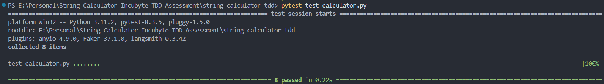  |
| Delimiters of Any Length  | 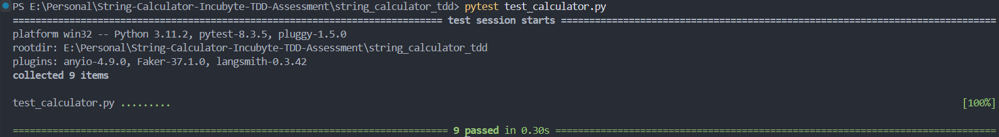  |
| Multiple Delimiters | 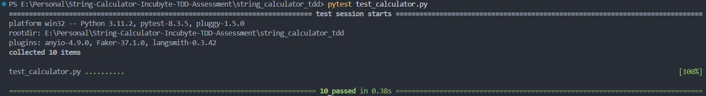 |
| Multi-Char Multiple Delimiters | 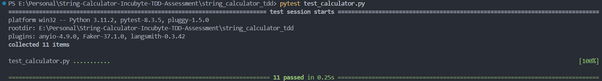 |
| Only Delimiters, No Numbers |  |

---

## 👨‍💻 Author

*Maharshi Jani*

---

## 🏁 Final Notes

This project demonstrates my understanding of:

* Test-Driven Development (TDD)
* Clean, readable, and testable Python code
* Regex handling
* Writing effective unit tests using pytest
